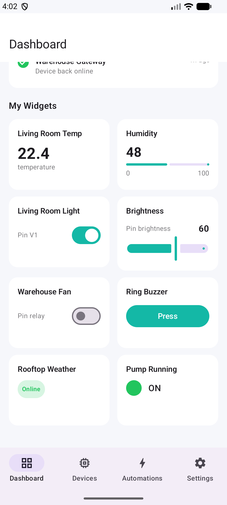
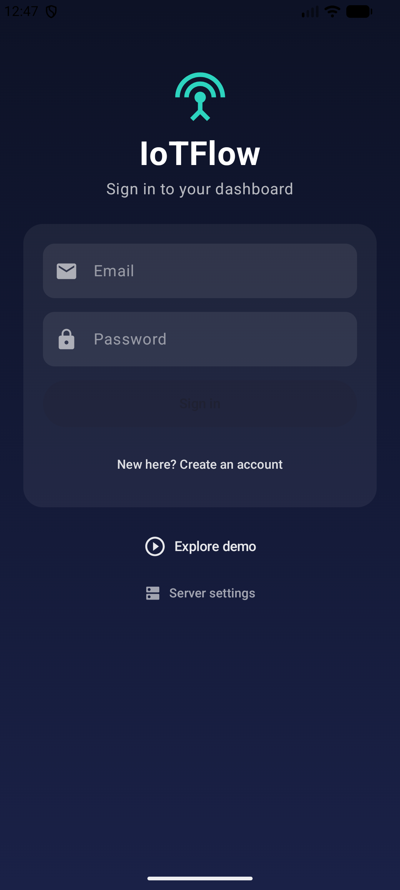
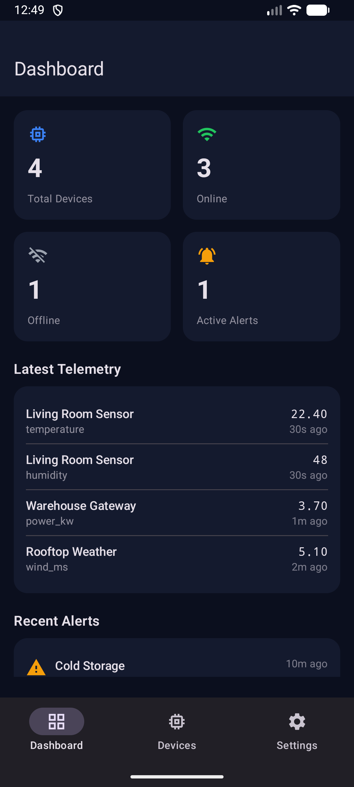
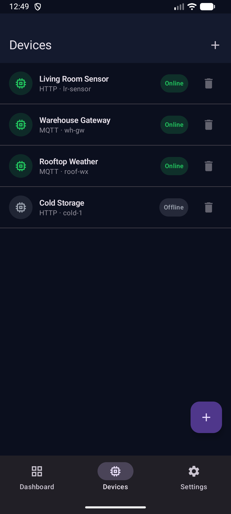
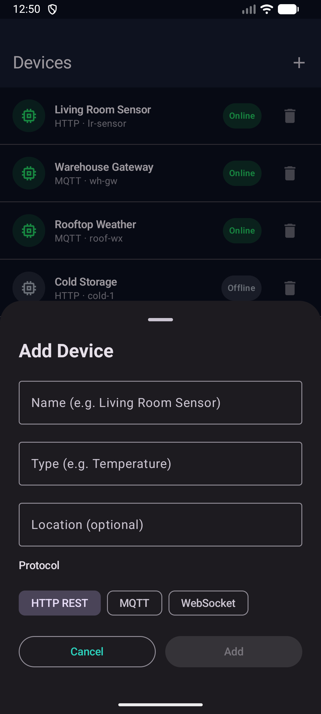
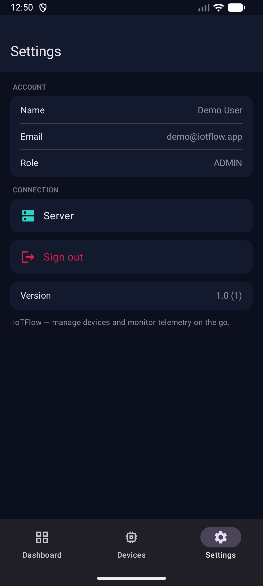
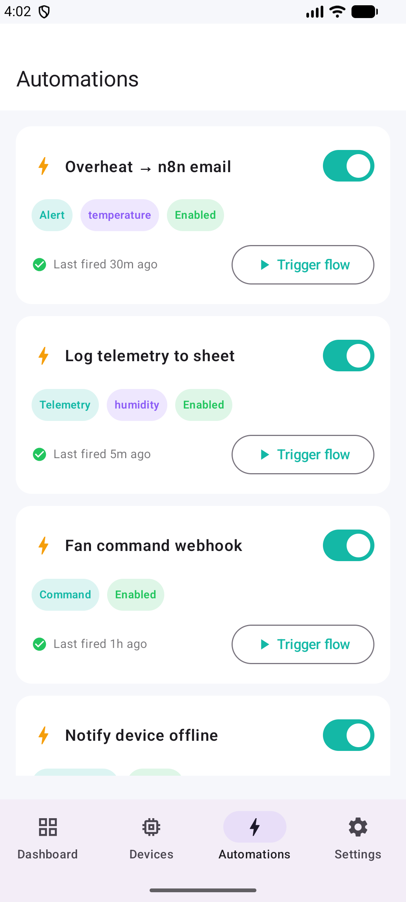

# IoTFlow Android


A native **Kotlin + Jetpack Compose** Android client for the
[IoTFlow](https://iot.tertiaryinfotech.com/) self-hosted IoT platform
([backend](https://github.com/alfredang/iotplatform) ·
[iOS app](https://github.com/alfredang/iotplatformapp)). Add devices, monitor
live telemetry on dashboard widgets, trigger device actions and n8n automation
flows, and keep an eye on alerts — from your Android phone.

<p align="center">
  
</p>

## Screenshots
| Login | Dashboard | Devices | Add device | Settings | Automations |
|---|---|---|---|---|---|
|  |  |  |  |  |  |

## Features
- 🔐 Sign in / register against the IoTFlow backend (Auth.js credentials, cookie session)
- 📊 Dashboard — total / online / offline counts, active alerts, latest telemetry and recent alerts, pull-to-refresh
- 🧩 Dashboard widgets — number, gauge, LED and status displays plus **switch, slider, button and terminal controls** that write virtual pins (5 s live polling, mirrors the web dashboard)
- 📈 Live **line & bar charts** drawn from telemetry history
- ⚡ **Automations (n8n)** — list your flows, trigger a flow's n8n webhook (same as the web Test button), enable/disable
- 🔔 Alert notifications — polls while the app is open and notifies on new active alerts
- 🧩 Devices — live online/offline status, per-device detail, swipe/tap to delete
- ➕ Add a device — name, type, location, protocol (HTTP / MQTT / WebSocket); copyable one-time device token
- ⚙️ Settings — account info, configurable server URL, sign out, delete account
- ▶️ Demo mode — explore the full UI (widgets, controls, automations) with sample data, no backend needed

## Tech stack
| Area | Technology |
|---|---|
| Language | Kotlin |
| UI | Jetpack Compose + Material 3 |
| Networking | OkHttp (persistent CookieJar → NextAuth CSRF + credentials flow) |
| JSON | kotlinx.serialization |
| Architecture | `ApiClient` (object) · `SessionViewModel` · Compose screens |
| Persistence | SharedPreferences (server URL, session cookies, demo flag) |
| Min SDK | 24 (Android 7.0) · Target 36 |

## Backend API
| Endpoint | Use |
|---|---|
| `GET /api/auth/csrf` + `POST /api/auth/callback/credentials` | Sign in |
| `POST /api/auth/register` | Create account |
| `GET /api/auth/session` | Restore session |
| `GET /api/dashboard/summary` | Dashboard counts, telemetry, alerts |
| `GET /api/dashboard/widgets` | Dashboard widget definitions |
| `GET /api/devices/:id/telemetry?metric=&limit=` | Latest value + chart history |
| `GET/POST /api/devices/:id/command` | Read / write virtual pins (device control) |
| `GET/POST/PATCH /api/automations[/:id]` | List / trigger / enable n8n automations |
| `GET/POST /api/devices` · `DELETE /api/devices/:id` | List / add / remove devices |
| `DELETE /api/account` | Delete account (store policy) |

## Build
```bash
export JAVA_HOME="/Applications/Android Studio.app/Contents/jbr/Contents/Home"
./gradlew :app:assembleDebug      # debug APK
./gradlew :app:bundleRelease      # signed release AAB (needs keystore.properties)
```

Release signing reads `keystore.properties` (gitignored). The signed bundle is
written to `app/build/outputs/bundle/release/app-release.aab`.

See [play-assets/STORE_LISTING.md](play-assets/STORE_LISTING.md) for the Google
Play listing copy, screenshots and submission checklist, and
[CHANGELOG.md](CHANGELOG.md) for release history (current: **1.1**, versionCode 2).
